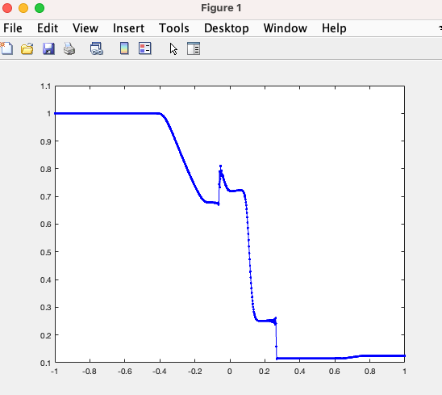

# Magnetohydrodynamic (MHD) Simulations

[](./LICENSE)


## Contexto del código
El codigo es una simulación del paper llamado "Implicit predictor–corrector central finite difference scheme for the equations of magnetohydrodynamic simulations" hecho por los siguientes investigadores:
1. T.C. Tsai
2. H.-S. Yu
3. M.-S. Hsieh
4. S.H. Lai
5. Y.-H. Yang

En el abstract del paper explican que el artículo propone un esquema de diferencia finita central implícita de alto orden predictor-corrector (iPCCFD) y demuestra su alta eficiencia en el cómputo paralelo. De especial interés son los estudios numéricos a gran escala, como las simulaciones magnetohidrodinámicas (MHD) en la magnetosfera planetaria. Se desarrolla un esquema iPCCFD basado en el método de diferencia finita central de quinto orden y el método implícito predictor-corrector de cuarto orden en combinación con la técnica de eliminación de errores de redondeo (ERE). Se examinan varios estudios numéricos, como el problema unidimensional del tubo de choque Brio-Wu, el sistema de vórtices Orszag-Tang bidimensional, la inestabilidad de tipo K-H de vórtices, la inestabilidad de tipo K-H de tipo kink, la advección de lazo de campo y la onda de choque. Todos los resultados de las simulaciones son consistentes con numerosas literaturas. iPCCFD puede minimizar las inestabilidades y ruidos numéricos junto con los términos adicionales de difusión. Todos nuestros estudios presentan errores numéricos relativamente pequeños sin emplear ninguna reconstrucción libre de divergencia. En particular, obtenemos resultados bastante estables en el problema bidimensional del tubo de choque Brio-Wu que conserva bien ∇ · B = 0 en toda la simulación. La técnica ERE elimina la acumulación de errores de redondeo en el sistema uniforme o no perturbado. También hemos demostrado que iPCCFD se caracteriza por su alto orden de precisión y baja disipación numérica en las pruebas de onda de Alfvén polarizada circularmente. El esquema propuesto iPCCFD es un esquema numérico paralelo-eficiente y de alta precisión para resolver las ecuaciones MHD en sistemas de conservación hiperbólica.

## Código original
Se proporciono un codigo en Matlab con el fin de pasarlo a C y paralelizarlo con MPI o con openMP para mejorar el rendimiento. El código en Matlab es el siguiente:
```Matlab
function mhd()
    global nNodos
    nNodos = 1000;
    W = 0.0085;
    x = linspace(-1,1,nNodos);
    dx = abs(x(2)-x(1));
    gamma = 2;
    dt = 0.0005;
    tMax = 0.20;
    rho1 = 1.0; 
    Vx1 =  0.0;
    Vy1 =  0.0;
    Vz1 =  0.0;
    p1 = 1.0; 
    Bx1 = 0.75;
    By1 = 1.0;
    Bz1 =  0.0;
    rho2 =  0.125;
    Vx2 =  0;
    Vy2 =  0;
    Vz2 =  0;
    p2 =  0.1;
    Bx2 =  0.75;
    By2 = -1.0; 
    Bz2 =  0;
    rho = (rho2+rho1)/2 + ((rho2-rho1)/2).*tanh(x/W);
    Vx = (Vx2+Vx1)/2 + ((Vx2-Vx1)/2).*tanh(x/W);
    Vy = (Vy2+Vy1)/2 + ((Vy2-Vy1)/2).*tanh(x/W);
    Vz = (Vz2+Vz1)/2 + ((Vz2-Vz1)/2).*tanh(x/W);
    p = (p2+p1)/2 + ((p2-p1)/2).*tanh(x/W);
    Bx = (Bx2+Bx1)/2 + ((Bx2-Bx1)/2).*tanh(x/W);
    By = (By2+By1)/2 + ((By2-By1)/2).*tanh(x/W);
    Bz = (Bz2+Bz1)/2 + ((Bz2-Bz1)/2).*tanh(x/W);
    U = getU(Bx,By,Bz,rho,p,Vx,Vy,Vz,gamma);
    [U1,U2,U3] = getFirst3U(U,dt);
    UNMenos3 = U;
    UNMenos2 = U1;
    UNMenos1 = U2;
    Un = U3;
    LUnMenos3 = getLU(UNMenos3);
    LUnMenos2 = getLU(UNMenos2);
    LUnMenos1 = getLU(UNMenos1);
    tiempo = 3*dt;
    m = 3;
    while tMax > tiempo 
        tiempo = tiempo + dt;
        LUn =  getLU(Un);
        UIM = Un + dt*(55/24*LUn - 59/24*LUnMenos1 + 37/24*LUnMenos2 -9/24*LUnMenos3);
        LUIM =  getLU(UIM);
        UNmasUno = Un + dt*(9/24*LUIM + 19/24*LUn - 5/24*LUnMenos1 + 1/24*LUnMenos2);
        tol = 1e-15;
        error = 1.0;
        n = 1;
        while error > 20*eps 
            LUNmasUno =  getLU(UNmasUno);
            UNmasUnoP = Un + dt*(9/24*LUNmasUno + 19/24*LUn - 5/24*LUnMenos1 + 1/24*LUnMenos2);
            error = max(max((abs(UNmasUno - UNmasUnoP))));
            UNmasUno = UNmasUnoP;
            n= n+1;
        end
        UNMenos3 = UNMenos2;
        UNMenos2 = UNMenos1;
        UNMenos1 = Un;
        Un = UNmasUno;
        LUnMenos3 = getLU(UNMenos3);
        LUnMenos2 = getLU(UNMenos2);
        LUnMenos1 = getLU(UNMenos1);
        plot(x,Un(4,:),'-b.')
        pause(0.01)
        m = m+1
    end
end


function U = getU(Bx,By,Bz,rho,p,Vx,Vy,Vz,gamma)
    Mx = rho.*Vx;
    My = rho.*Vy;
    Mz = rho.*Vz;
    V = sqrt(Vx.^2 + Vy.^2 + Vz.^2);
    B = sqrt(Bx.^2 + By.^2 + Bz.^2);
    E = p/(gamma-1) + 1/2*rho.*(V.^2) + (B.^2)/2;
    U = [Bx;By;Bz;rho;Mx;My;Mz;E];
end

function F = getF(U)
    Bx = U(1,:);
    By = U(2,:);
    Bz = U(3,:);
    rho = U(4,:);
    Vx = U(5,:)./rho;
    Vy = U(6,:)./rho;
    Vz = U(7,:)./rho;
    E = U(8,:);
    gamma = 2.0;
    F = zeros(8,length(Bx));
    B= sqrt(Bx.^2 + By.^2 + Bz.^2);
    V = sqrt(Vx.^2 + Vy.^2 + Vz.^2);
    p = (E-1/2*rho.*V.^2 - (B.^2)/2)*(gamma-1);
    F(1,:) = 0;
    F(2,:) = (By.*Vx-Bx.*Vy);
    F(3,:) = (Bz.*Vx-Bx.*Vz);
    F(4,:) = rho.*Vx;
    F(5,:) = (rho.*Vx.^2 + (p + (B.^2)/2) - Bx.^2);
    F(6,:) = (rho.*Vx.*Vy - Bx.*By);
    F(7,:) = (rho.*Vx.*Vz - Bx.*Bz);
    F8a = ((1/2*rho.*V.^2 + (gamma*p/(gamma-1)) + B.^2).*Vx);
    F8b = (Bx.*(Bx.*Vx + By.*Vy + Bz.*Vz));
    F(8,:) = F8a-F8b;
end

function D = getD(U)
    Bx = U(1,:);
    By = U(2,:);
    Bz = U(3,:);
    rho = U(4,:);
    Vx = U(5,:)./rho;
    Vy = U(6,:)./rho;
    Vz = U(7,:)./rho;
    E = U(8,:);
    gamma = 2.0;
    B= sqrt(Bx.^2 + By.^2 + Bz.^2);
    V = sqrt(Vx.^2 + Vy.^2 + Vz.^2);
    p = (E-1/2*rho.*V.^2 - (B.^2)/2)*(gamma-1);
    D = zeros(8,length(Vx));
    D(5,:) = Vx;
    D(end,:) = p./rho;
end

function LU = getLU(U)
    rho = U(4,:);
    global nNodos
    x = linspace(-1,1,nNodos);
    dx = abs(x(2)-x(1));
    F = getF(U);
    D = getD(U);
    nNodes = length(F(1,:));
    dummy1 = zeros(length(F(:,1)),length(F(1,:)));
    dummy2 = zeros(length(F(:,1)),length(F(1,:)));
    etaV = 0.001;
    etaT = 0.001;
    a1 = 1/60;
    a2 = -3/20;
    a3 = 3/4;
    a4 = -3/4;
    a5 = 3/20;
    a6 = -1/60;
    for i=4:nNodes-3
        arreglo = a1*F(:,i+3)+ a2*F(:,i+2)+ a3*F(:,i+1)+ a4*F(:,i-1)+ a5*F(:,i-2) +a6*F(:,i-3);
        dummy1(:,i) = arreglo;
    end
    b1 = 1/90;
    b2 = -3/20;
    b3 = 3/2;
    b4 = -49/18;
    b5 = 3/2;
    b6 = -3/20;
    b7 = 1/90;
    for i=4:nNodes-3
        arreglo = b1*D(:,i+3) + b2*D(:,i+2) +  b3*D(:,i+1) +  b4*D(:,i) +  b5*D(:,i-1) +  b6*D(:,i-2) +  b7*D(:,i-3);
        dummy2(:,i) = arreglo;
    end
    dummy2(5,:) = etaV*rho.*dummy2(5,:);
    dummy2(end,:) = etaT*rho.*dummy2(end,:);
    LU = dummy1/dx + dummy2/(dx^2);
end

function [U1,U2,U3] = getFirst3U(U,dt)
    LU = getLU(U);
    U1fake = U + dt/2*LU;
    LU1 = getLU(U1fake);
    U2fake = U + dt/2*LU1;
    LU2 = getLU(U2fake);
    U3fake = U + dt*LU2;
    LU3 = getLU(U3fake);
    U1 = U + dt*(1/6*LU + 1/3*LU1 + 1/3*LU2 + 1/6*LU3);
    LU = getLU(U1);
    U1fake = U1 + dt/2*LU;
    LU1 = getLU(U1fake);
    U2fake = U1 + dt/2*LU1;
    LU2 = getLU(U2fake);
    U3fake = U1 + dt*LU2;
    LU3 = getLU(U3fake);
    U2 = U1 + dt*(1/6*LU + 1/3*LU1 + 1/3*LU2 + 1/6*LU3);
    LU = getLU(U2);
    U1fake = U2 + dt/2*LU;
    LU1 = getLU(U1fake);
    U2fake = U2 + dt/2*LU1;
    LU2 = getLU(U2fake);
    U3fake = U2 + dt*LU2;
    LU3 = getLU(U3fake);
    U3 = U2 + dt*(1/6*LU + 1/3*LU1 + 1/3*LU2 + 1/6*LU3);
end
```

En el codigo proporcionado, lo que muestra como output es una grafica como la que se ve a continuacion:


## Que se hace y porqué 
En este repositorio se traslada el codigo de Matlab anterior a código en C. La razón de pasarlo a C es para mejorar la optimización del código y que dé resultados más rápidos que en Matlab. Además, se usa codigo paralelo en C para que sea aun mejor la optimización y rapidez de la ejecución de la simulación. Al compilarlo se tendrá como salida un archivo .txt con las coordenadas del eje X y eje Y que pueden ser usadas para graficarlas con GNUplot. Tiene entonces dos versiones en C, uno serial y otro paralelo.

## Dependencias de bibliotecas
Las biblitecas que hay que tener instaladas en el sistema son:
1. OpenMP - Es necesario para la programación paralela.
2. GNUplot - Es una herramienta para generar gráficos y visualizar datos.

## Compilar
### Código serial
Compila el programa utilizando un compilador de C, como GCC (GNU Compiler Collection). El comando para compilar podría ser similar al siguiente:

```bash
gcc -o mhd *.c -lm
```
NOTA: revisa estar dentro de la carpeta con el código serial (MHD-serial) para que compile todos los archivos de C.

Ejecuta el programa ejecutable desde la terminal con el siguiente comando:
```bash
./mhd
```

### Código paralelo
Para el código paralelo se hace algo similar, solo que se incluye la biblioteca de OpenMP. Se compila usando el siguiente comando:
```bash
gcc -o mhd_openmp *.c -fopenmp -lm
```
NOTA: revisa estar dentro de la carpeta con el código serial (MHD-paralelo) para que compile todos los archivos de C.

Ejecuta el programa ejecutable desde la terminal con el siguiente comando:
```bash
./mhd_openmp
```


## Graficar
Para graficar los resultados del archivo .txt se utiliza las siguientes instrucciones
```bash
$ gnuplot
set datafile separator " "
plot 'datos.txt' using 1:2 with lines
``` 
Importante mencionar que la grafica que proporciona depende de la cantidad de nodos que se especifiquen en el código C.

## Limitaciones
En esta seccion se da una lista de las limitaciones:
1. no siempre se logra imprimir correctamente en el archivo .txt y esto afecta a la hora de graficar.
2. la versión paralela no necesariamente es más rápida que la versión serial.
